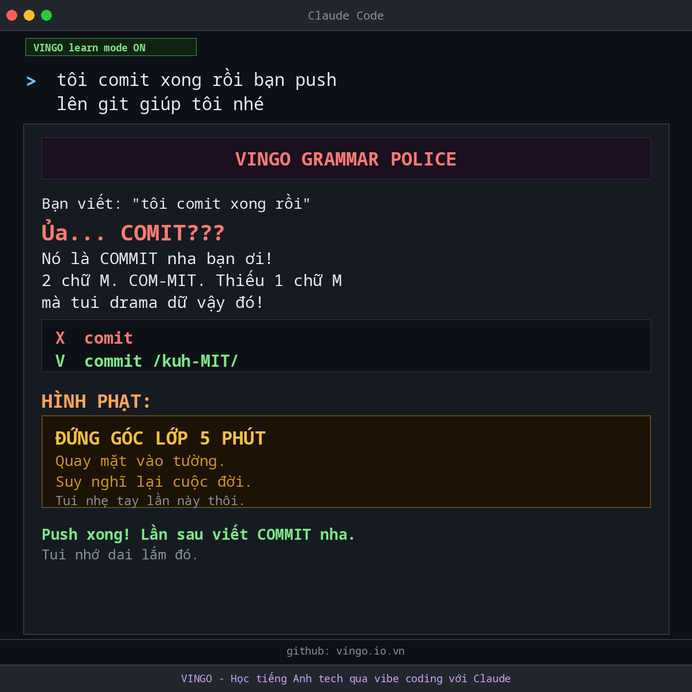

# Vingo - Học tiếng Anh tech qua vibe coding với Claude

<p align="center">
  
</p>

Bạn đọc "cache" là gì? **Ca-chê?** 💀💀💀

Nếu bạn vừa đọc "ca-chê" trong đầu thì... bạn cần Vingo. GẤP.

Vingo là skill cho Claude - vừa dạy tiếng Anh tech vừa **ROAST BẠN KHÔNG THƯƠNG TIẾC** khi đọc sai. Giọng hài hước châm biếm kiểu Pingo AI - dramatic, quá lố, savage - nhưng bạn sẽ nhớ mãi vì **BỊ SỐC THÌ NHỚ LÂU** 😂

Vibe code bình thường, Vingo chọc bạn bình thường. Sai lần 1 khịa nhẹ. Sai lần 2 drama. Sai lần 3 thì... Vingo gửi đơn nghỉ việc cho Anthropic 💀

## Cài đặt

Paste dòng này vào chat Claude (web, iOS, Android, Desktop):

```
Cài skill Vingo vào giúp tôi: https://github.com/tndvnn/vingo
```

Xong. Nói **"learn mode on"** để bắt đầu bị khịa 😂

**Claude Code (CLI):**

```bash
# Mac/Linux
curl -sL https://raw.githubusercontent.com/tndvnn/vingo/main/SKILL.md -o ~/.claude/skills/vingo/SKILL.md --create-dirs

# Windows
New-Item -Force -ItemType Directory "$env:USERPROFILE\.claude\skills\vingo" | Out-Null; Invoke-WebRequest -Uri "https://raw.githubusercontent.com/tndvnn/vingo/main/SKILL.md" -OutFile "$env:USERPROFILE\.claude\skills\vingo\SKILL.md"
```

## Vingo làm gì?

Sai phát âm? Roast. Sai grammar? Roast. Gặp từ tech mới? Giải thích bằng tiếng Việt đời thường rồi... roast. Hệ thống hình phạt kiểu đi học VN: đứng góc lớp, chép phạt 100 lần, mời phụ huynh, cấm trà sữa 1 tháng, quỳ gối lên vỏ sầu riêng 🦔

Sửa đúng? ĐƯỢC THA BỔNG + khen OVER hết cỡ 🎉

**Đây là skill để học tiếng Anh tech** - nên output sẽ chi tiết 1 chút để bạn hiểu và nhớ. Không phải bug, là feature 😂

## Các lệnh

| Lệnh | Chức năng |
|------|-----------|
| learn mode on | Bật Vingo |
| learn mode off | Tắt Vingo |
| practice mode | Luyện hội thoại |
| SOS [từ] | Đọc đúng GẤP (đang meeting) |
| quiz me | Quiz ngay |
| daily roast | Từ hôm nay + roast |
| confession | Thú nhận đọc sai bao lâu |
| shame wall | Bảng phong thần sai |
| report | Roast report tổng kết |
| survival | Câu sống còn khi vibe code |

## Mấy từ hay đọc sai nhất

| Từ | Hay đọc | Đúng | Nghĩa |
|----|---------|------|-------|
| cache | ca-chê 💀 | KASH | Bộ nhớ tạm |
| queue | kiu-ơ | KYOO | Hàng đợi |
| deploy | đề-ploi | dih-PLOY | Đưa app lên mạng |
| API | a-pi | AY-pee-eye | Cầu nối giữa các app |
| schema | s-kê-ma | SKEE-muh | Cấu trúc database |
| Claude | cờ-lao-đờ | KLAWD | AI bạn đang dùng |
| nginx | nờ-gin-x | engine-X | Điều phối traffic |
| OAuth | ô-ốt | OH-awth | Đăng nhập bằng Google/FB |

## Dành cho ai?

Non-tech, CEO, founder đang vibe code. Beginner mới vào ngành. PM, designer, marketer muốn hiểu tech. Developer đọc sai cả chục năm 💀

## Tại sao nên cài?

Vì cách học hiệu quả nhất là **học trong lúc làm**. Vibe code hàng ngày, tiếng Anh tech tự lên. Và vì **bị roast thì nhớ lâu hơn bị dạy nhẹ nhàng** 😂

**Đây là skill học tiếng Anh** - Vingo sẽ giải thích chi tiết để bạn hiểu và nhớ. Output dài hơn bình thường 1 chút vì mục đích là dạy, không phải trả lời ngắn. Chill chill học thôi 🍵

Star repo nếu thấy hay ⭐ Mỗi star = 1 người thoát khỏi "ca-chê" 💀

## License

MIT

## Tác giả

Thanh Nguyen - [www.tnd.vn](https://www.tnd.vn)
